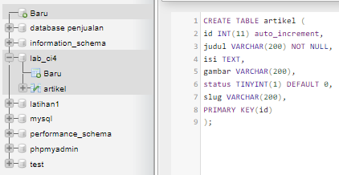

# Praktikum 11: PHP Framework (Codeigniter)
Repository ini dibuat untuk memenuhi tugas Pemrograman Web
| Nama      | Lydia Diffani Siregar |
| ----------- | ----------- |
| NIM     | 312010498       |
| Kelas   | TI.20.A.1        |

# Langkah-langkah Praktikum
Sebelum memulai menggunakan Framework Codeigniter, perlu dilakukan konfigurasi pada webserver. Beberapa ekstensi PHP perlu diaktifkan untuk kebutuhan pengembangan Codeigniter 4. Berikut beberapa ekstensi yang perlu diaktifkan:
<p> <strong> • php-json </strong> ekstension untuk bekerja dengan JSON; </p>
<p> <strong> • php-mysqlnd </strong> native driver untuk MySQL; </p>
<p> <strong> • php-xml </strong> ekstension untuk bekerja dengan XML; </p>
<p> <strong> • php-intl </strong> ekstensi untuk membuat aplikasi multibahasa; </p>
<p> <strong> • libcurl </strong> (opsional), jika ingin pakai Curl. Untuk mengaktifkan ekstentsi tersebut, </p>

Untuk mengaktifkan ekstentsi tersebut, melalu <strong> XAMPP Control Panel </strong>, pada bagian Apache klik <strong> Config -> PHP.ini </strong>


Setelah klik PHP(php.ini), pada bagian extention, hilangkan tanda ; (titik koma) pada ekstensi yang akan diaktifkan. Kemudian simpan kembali filenya dan restart Apache web server.


# <p> Instalasi Codeigniter 4 </p>
<p> Untuk melakukan instalasi Codeigniter 4 dapat dilakukan dengan dua cara, yaitu cara manual dan menggunakan composer. Pada praktikum ini kita menggunakan cara manual. </p>
<p> • Unduh Codeigniter dari website https://codeigniter.com/download </p>
<p> • Extrak file zip Codeigniter ke direktori htdocs/lab11_php_ci. </p>
<p> • Ubah nama direktory framework-4.x.xx menjadi ci4. </p>
<p> • Buka browser dengan alamat http://localhost/Lab11Web/lab11_php_ci/ci4/public/ </p>


# <p> Menjalankan CLI (Command Line Interface) </p>
<p> Codeigniter 4 menyediakan CLI untuk mempermudah proses development. Untuk mengakses CLI buka terminal/command prompt. </p>


Arahkan lokasi direktori sesuai dengan direktori kerja project dibuat (xampp/htdocs/lab11_ci/ci4/)

Setelah itu kita memanggil CLI Codeigniter dengan menjalankan perintah:
```php
php spark
```


# <p> Mengaktifkan Mode Debugging </p>
<p> Codeigniter 4 menyediakan fitur debugging untuk memudahkan developer untuk
mengetahui pesan error apabila terjadi kesalahan dalam membuat kode program.
Secara default fitur ini belum aktif. Ketika terjadi error pada aplikasi akan ditampilkan
pesan kesalahan seperti berikut. </p>


<p> Semua jenis error akan ditampilkan sama. Untuk memudahkan mengetahui jenis
errornya, maka perlu diaktifkan mode debugging dengan mengubah nilai konfigurasi
pada environment variable <strong> CI_ENVIRINMENT </strong> menjadi <strong> development.</strong> </p>


<p> Ubah nama file env menjadi .env kemudian buka file tersebut dan ubah nilai variable
<strong> CI_ENVIRINMENT </strong> menjadi <strong> development. </strong> </p>


Contoh error yang terjadi. Untuk mencoba error tersebut, ubah kode pada file
app/Controller/Home.php hilangkan titik koma pada akhir kode.


# Struktur Direktori
Untuk lebih memahami Framework Codeigniter 4 perlu mengetahui struktur direktori
dan file yang ada. Buka pada <strong> Windows Explorer </strong> atau dari <strong> Visual Studio Code </strong> -> <strong> Open Folder. </strong> Terdapat beberapa direktori dan file yang perlu dipahami fungsi dan kegunaannya. </p>
 <p> • <strong> .github </strong> folder ini kita butuhkan untuk konfigurasi repo github, seperti konfigurasi
untuk build dengan github action; </p>
 <p> • <strong> app </strong> folder ini akan berisi kode dari aplikasi yang kita kembangkan; </p>
 <p> • <strong> public </strong> folder ini berisi file yang bisa diakses oleh publik, seperti file index.php,
robots.txt, favicon.ico, ads.txt, dll; </p>
 <p> • <strong> tests </strong> folder ini berisi kode untuk melakukan testing dengna PHPunit; </p>
 <p> • <strong> vendor </strong> folder ini berisi library yang dibutuhkan oleh aplikasi, isinya juga termasuk
kode core dari system CI. </p>
 <p> • <strong> writable </strong> folder ini berisi file yang ditulis oleh aplikasi. Nantinya, kita bisa pakai
untuk menyimpan file yang di-upload, logs, session, dll. Sedangkan file-file yang berada pada root direktori CI sebagai berikut. </p>
 <p> • <strong> .env </strong> adalah file yang berisi variabel environment yang dibutuhkan oleh aplikasi. </p>
 <p>• <strong> .gitignore </strong> adalah file yang berisi daftar nama file dan folder yang akan diabaikan
oleh Git. </p>
 <p> • <strong> build </strong> adalah script untuk mengubah versi codeigniter yang digunakan. Ada versi
release (stabil) dan development (labil). </p>
 <p> • <strong> composer.json </strong> adalah file JSON yang berisi informasi tentang proyek dan daftar
library yang dibutuhkannya. File ini digunakan oleh Composer sebagai acuan. </p>
 <p> • <strong>composer.lock </strong> adalah file yang berisi informasi versi dari libraray yang digunakan
aplikasi. </p>
 <p> • <strong> license.txt </strong> adalah file yang berisi penjelasan tentang lisensi Codeigniter; </p>
 <p> • <strong> phpunit.xml.dist </strong> adalah file XML yang berisi konfigurasi untuk PHPunit. </p>
 <p> • <strong> README.md </strong> adalah file keterangan tentang codebase CI. Ini biasanya akan
dibutuhkan pada repo github atau gitlab. </p>
 <p> • <strong> spark </strong> adalah program atau script yang berfungsi untuk menjalankan server,
generate kode, dll. </p>


Fokus kita pada folder <strong> app </strong>, dimana folder tersebut adalah area kerja kita untuk
membuat aplikasi. Dan folder <strong> public </strong> untuk menyimpan aset web seperti css, gambar,
javascript, dll.

# <p> Memahami Konsep MVC </p>
Codeigniter menggunakan konsep MVC. MVC meripakan singkatan dari
Model-View-Controller. MVC merupakan konsep arsitektur yang umum digunakan
dalam pengembangan aplikasi. Konsep MVC adalah memisahkan kode program
berdasarkan logic proses, data, dan tampilan. Untuk logic proses diletakkan pada
direktori Contoller, Objek data diletakkan pada direktori Model, dan desain tampilan
diletakkan pada direktori View.

Codeigniter menggunakan konsep pemrograman berorientasi objek dalam
mengimplementasikan konsep MVC.

<strong> Model </strong> merupakan kode program yang berisi pemodelan data. Data dapat berupa
database ataupun sumber lainnya.

<strong> View </strong> merupakan kode program yang berisi bagian yang menangani terkait tampilan
user interface sebuah aplikasi. didalam aplikasi web biasanya pasti akan berhubungan
dengan html dan css.

<strong> Controller </strong> merupakaan kode program yang berkaitan dengan logic proses yang
menghubungkan antara view dan model. Controller berfungsi untuk menerima request
dan data dari user kemudian diproses dengan menghubungkan bagian model dan view.

<strong> Routing dan Controller </strong>
Routing merupakan proses yang mengatur arah atau rute dari request untuk menentukan
fungsi/bagian mana yang akan memproses request tersebut. Pada framework CI4,
routing bertujuan untuk menentukan Controller mana yang harus merespon sebuah
request. Controller adalah class atau script yang bertanggung jawab merespon sebuah
request.

Pada Codeigniter, request yang diterima oleh file index.php akan diarahkan ke Router
untuk meudian oleh router tesebut diarahkan ke Controller.

<p> Router terletak pada file <strong> app/config/Routes.php </strong> </p>


Pada file tersebut kita dapat mendefinisikan route untuk aplikasi yang kita buat.

Contoh:
```php
$routes->get('/', 'Home::index');
```

Kode tersebut akan mengarahkan rute untuk halaman home.

# Membuat Route Baru.
<p> Tambahkan kode berikut di dalam <strong> Routes.php </strong> </p>

```php
$routes->get('/about', 'Page::about');
$routes->get('/contact', 'Page::contact');
$routes->get('/faqs', 'Page::faqs');
```

Untuk mengetahui route yang ditambahkan sudah benar, buka CLI dan jalankan
perintah berikut.
```php
php spark routes
```


Selanjutnya coba akses route yang telah dibuat dengan mengakses alamat url
http://localhost:8080/about


Ketika diakses akan mucul tampilan error 404 file not found, itu artinya file/page
tersebut tidak ada. Untuk dapat mengakses halaman tersebut, harus dibuat terlebih
dahulu Contoller yang sesuai dengan routing yang dibuat yaitu Contoller Page.

# Membuat Controller
Selanjutnya adalah membuat Controller Page. Buat file baru dengan nama <strong> page.php </strong>
pada direktori Controller kemudian isi kodenya seperti berikut.

```php
<?php
namespace App\Controllers;
class Page extends BaseController
{
public function about()
{
echo "Ini halaman About";
}
public function contact()
{
echo "Ini halaman Contact";
}
public function faqs()
{
echo "Ini halaman FAQ";
}
}
```

<p> Selanjutnya refresh Kembali browser, maka akan ditampilkan hasilnya yaotu halaman
sudah dapat diakses. </p>


# Auto Routing
Secara default fitur autoroute pada Codeiginiter sudah aktif. Untuk mengubah status
autoroute dapat mengubah nilai variabelnya. Untuk menonaktifkan ubah nilai true
menjadi <strong> false. </strong> 

```php
$routes->setAutoRoute(true);
```

Tambahkan method baru pada Controller Page seperti berikut.

```php
public function tos()
{
echo "ini halaman Term of Services";
}
```

Method ini belum ada pada routing, sehingga cara mengaksesnya dengan menggunakan
alamat: http://localhost/Lab11Web/lab11_php_ci/ci4/public/page/tos


# Membuat View
Selanjutnya adalam membuat view untuk tampilan web agar lebih menarik. Buat file
baru dengan nama about.php pada direktori view (app/view/about.php) kemudian isi
kodenya seperti berikut.

```php
<!DOCTYPE html>
<html lang="en">
<head>
<meta charset="UTF-8">
<title><?= $title; ?></title>
</head>
<body>
<h1><?= $title; ?></h1>
<hr>
<p><?= $content; ?></p>
</body>
</html>
```

Ubah method about pada class Controller Page menjadi seperti berikut:

```php
public function about()
{
return view('about', [
'title' => 'Halaman Abot',
'content' => 'Ini adalah halaman abaut yang menjelaskan tentang isi
halaman ini.'
]);
}
```

Kemudian lakukan refresh pada halaman tersebut.


# Membuat Layout Web dengan CSS
Pada dasarnya layout web dengan css dapat diimplamentasikan dengan mudah pada
codeigniter. Yang perlu diketahui adalah, pada Codeigniter 4 file yang menyimpan asset
css dan javascript terletak pada direktori public.

Buat file css pada direktori public dengan nama style.css (copy file dari praktikum
lab4_layout. Kita akan gunakan layout yang pernah dibuat pada praktikum 4.


Kemudian buat folder template pada direktori view kemudian buat file header.php dan
footer.php

File app/view/template/header.php

```php
<!DOCTYPE html>
<html lang="en">
<head>
<meta charset="UTF-8">
<title><?= $title; ?></title>
<link rel="stylesheet" href="<?= base_url('/style.css');?>">
</head>
<body>
<div id="container">
<header>
<h1>Layout Sederhana</h1>
</header>
<nav>
<a href="<?= base_url('/');?>" class="active">Home</a>
<a href="<?= base_url('/artikel');?>">Artikel</a>
<a href="<?= base_url('/about');?>">About</a>
<a href="<?= base_url('/contact');?>">Kontak</a>
</nav>
<section id="wrapper">
<section id="main">
```

File app/view/template/footer.php

```php
</section>
<aside id="sidebar">
<div class="widget-box">
<h3 class="title">Widget Header</h3>
<ul>
<li><a href="#">Widget Link</a></li>
<li><a href="#">Widget Link</a></li>
</ul>
</div>
<div class="widget-box">
<h3 class="title">Widget Text</h3>
<p>Vestibulum lorem elit, iaculis in nisl volutpat, malesuada
tincidunt arcu. Proin in leo fringilla, vestibulum mi porta, faucibus felis.
Integer pharetra est nunc, nec pretium nunc pretium ac.</p>
            </div>
        </aside>
    </section>
    <footer>
        <p>&copy; 2021 - Universitas Pelita Bangsa</p>
    </footer>
    </div>
</body>
</html>
```

Kemudian ubah file app/view/about.php seperti berikut.
```php
<?= $this->include('template/header'); ?>
<h1><?= $title; ?></h1>
<hr>
<p><?= $content; ?></p>
<?= $this->include('template/footer'); ?>
```

Selanjutnya refresh tampilan pada alamat http://localhost:8080/about


# Pertanyaan dan Tugas
Lengkapi kode program untuk menu lainnya yang ada pada Controller Page, sehingga
semua link pada navigasi header dapat menampilkan tampilan dengan layout yang
sama.


# Praktikum 12: Framework Lanjutan (CRUD)

Membuat Database: Studi Kasus Data Artikel

# Membuat Database
jalankan apache dan mysql pada Xampp dan membuat database baru dengan nama

```php
CREATE DATABASE lab_ci4;
```

di http://localhost/phpmyadmin

<strong> Membuat Tabel </strong>

```php
CREATE TABLE artikel (
    id INT(11) auto_increment,
    judul VARCHAR(200) NOT NULL,
    isi TEXT,
    gambar VARCHAR(200),
    status TINYINT(1) DEFAULT 0,
    slug VARCHAR(200),
    PRIMARY KEY(id)
);
```

s

# Konfigurasi koneksi database
Selanjutnya membuat konfigurasi untuk menghubungkan dengan database server. Konfigurasi dapat dilakukan dengan dua cara, yaitu pada file <strong> app/config/database.php </strong> atau menggunakan file <strong> .env </strong>. Pada praktikum ini kita gunakan konfigurasi pada file <strong> .env</strong>. Hapus tanda #.


# Membuat Model
Selanjutnya adalah membuat Model untuk memproses data Artikel. Buat file baru pada direktori app/Models dengan nama <strong> ArtikelModel.php </strong>

```php
<?php
namespace App\Models;
use CodeIgniter\Model;
class ArtikelModel extends Model
{
protected $table = 'artikel';
protected $primaryKey = 'id';
protected $useAutoIncrement = true;
protected $allowedFields = ['judul', 'isi', 'status', 'slug', 'gambar'];
}
```


# Membuat Controller
Buat Controller baru dengan nama Artikel.php pada direktori app/Controllers.

```php
<?php
namespace App\Controllers;
use App\Models\ArtikelModel;
class Artikel extends BaseController
{
    public function index()
    {
        $title = 'Daftar Artikel';
        $model = new ArtikelModel();
        $artikel = $model->findAll();
        return view('artikel/index', compact('artikel', 'title'));
    }
}
```


# Membuat View
Buat direktori baru dengan nama artikel pada direktori <strong> app/views <strong>, kemudian buat file baru dengan nama <strong> index.php. </strong>


Selanjutnya buka browser kembali, dengan mengakses url http://localhost:8080/artikel


Belum ada data yang ditampilkan. Kemudian coba tambahkan beberapa data pada
database agar dapat ditampilkan datanya.

# Masukkan data ke tabel artikel
pada http://localhost/phpmyadmin

```php
INSERT INTO artikel (judul, isi, slug) VALUE
('Artikel pertama', 'Lorem Ipsum adalah contoh teks atau dummy dalam industri
percetakan dan penataan huruf atau typesetting. Lorem Ipsum telah menjadi
standar contoh teks sejak tahun 1500an, saat seorang tukang cetak yang tidak
dikenal mengambil sebuah kumpulan teks dan mengacaknya untuk menjadi sebuah
buku contoh huruf.', 'artikel-pertama'),
('Artikel kedua', 'Tidak seperti anggapan banyak orang, Lorem Ipsum bukanlah
teks-teks yang diacak. Ia berakar dari sebuah naskah sastra latin klasik dari
era 45 sebelum masehi, hingga bisa dipastikan usianya telah mencapai lebih
dari 2000 tahun.', 'artikel-kedua');
```


Refresh kembali browser, sehingga akan ditampilkan hasilnya.


# Membuat Tampilan Detail Artikel
Tampilan pada saat judul berita di klik maka akan diarahkan ke halaman yang berbeda.
Tambahkan fungsi baru pada Controller Artikel dengan nama <strong> view(). </strong>

```php
public function view($slug)
  {
    $model = new ArtikelModel();
    $artikel = $model->where([
    'slug' => $slug
    ])->first();
    // Menampilkan error apabila data tidak ada.
    if (!$artikel)
    {
      throw PageNotFoundException::forPageNotFound();
    }

    $title = $artikel['judul'];
    return view('artikel/detail', compact('artikel', 'title'));
}
```

# Membuat View Detail
Buat view baru untuk halaman detail dengan nama <strong> app/views/artikel/detail.php. </strong>

```php
<?= $this->include('template/header'); ?>
<article class="entry">
    <h2><?= $artikel['judul']; ?></h2>
    " alt="<?=
    $artikel['judul']; ?>">
    <p><?= $artikel['isi']; ?></p>
</article>

<?= $this->include('template/footer'); ?>
```

# Membuat Routing untuk artikel detail
Buka Kembali file <strong> app/config/Routes.php </strong>, kemudian tambahkan routing untuk artikel
detail.

```php
$routes->get('/artikel/(:any)', 'Artikel::view/$1');
```


# Membuat Menu Admin
Terletak di folder <strong> app/Controller, </strong> edit file <strong> Artikel.php.</strong> Tambah method <strong> admin_index().</strong>

```php
public function admin_index()
{
$title = 'Daftar Artikel';
$model = new ArtikelModel();
$artikel = $model->findAll();
return view('artikel/admin_index', compact('artikel', 'title'));
}
```


Selanjutnya buat view untuk tampilan admin dengan nama <strong> admin_index.php </strong>

```php
<?= $this->include('template/admin_header'); ?>
<table class="table table-bordered table-hover">
    <thead>
        <tr class="table-primary">
            <th scope="col">ID</th>
            <th scope="col">Judul</th>
            <th scope="col">Status</th>
            <th scope="col">Aksi</th>
        </tr>
    </thead>
    <tbody>
        <?php if($artikel): foreach($artikel as $row): ?>
        <tr>
            <td><?= $row['id']; ?></td>
            <td>
                <b><?= $row['judul']; ?></b>
                <p><small><?= substr($row['isi'], 0, 50); ?></small></p>
            </td>
            <td><?= $row['status']; ?></td>
            <td>
                <a class="btn btn-primary p-1" href="<?= base_url('/admin/artikel/edit/' . 
                $row['id']);?>">Ubah</a>
                <a class="btn btn-danger p-1" onclick="return confirm('Yakin menghapus data?');" href="<?= base_url('/admin/artikel/delete/' . 
                $row['id']);?>">Hapus</a>
            </td>
        </tr>
        <?php endforeach; else: ?>
        <tr>
            <td colspan="4">Belum ada data.</td>
        </tr>
        <?php endif; ?>
    </tbody>
    <tfoot>
        <tr class="table-primary">
            <th scope="col">ID</th>
            <th scope="col">Judul</th>
            <th scope="col">Status</th>
            <th scope="col">Aksi</th>
        </tr>
    </tfoot>
</table>
<?= $this->include('template/admin_footer'); ?>
```

Buka folder yang ada di app/Views/artikel/template, kemudian buat:

admin_header.php,
```php
<!DOCTYPE html>
<html lang="en">
    <head>
        <meta charset="UTF-8">
        <title><?= $title; ?></title>
        <!-- CSS only -->
        <link rel="stylesheet" href="<?= base_url('/style.css');?>">
        <link href="https://cdn.jsdelivr.net/npm/bootstrap@5.2.0-beta1/dist/css/bootstrap.min.css" rel="stylesheet" integrity="sha384-0evHe/X+R7YkIZDRvuzKMRqM+OrBnVFBL6DOitfPri4tjfHxaWutUpFmBp4vmVor" crossorigin="anonymous">
    </head>
    <body>
        <div id="container">
            <header>
                <h1>Admin Portal Berita</h1>
            </header>
            <nav>
                <a href="<?= base_url('/admin_index');?>" class="active">Dashboard</a>
                <a href="<?= base_url('/artikel');?>">Artikel</a>
                <a href="<?= base_url('/add');?>">Tambah Artikel</a>
            </nav>
            <section id="wrapper">
                <section id="main">
```

lalu buat juga <strong> admin_footer.php </strong> dilokasi yang sama dengan yang diatas.

 ```php
                </section>
            </section>
            <footer>
                <p>&copy; 2022 - Universitas Pelita Bangsa</p>
            </footer>
        </div>
    </body>
</html>
```

Tambahkan routing untuk menu admin seperti berikut:

```php
$routes->group('admin', function($routes) {
  $routes->get('artikel', 'Artikel::admin_index');
  $routes->add('artikel/add', 'Artikel::add');
  $routes->add('artikel/edit/(:any)', 'Artikel::edit/$1');
  $routes->get('artikel/delete/(:any)', 'Artikel::delete/$1');
});
```


Akses menu admin dengan url http://localhost:8080/admin/artikel


# Menambah Data Artikel
Terletak di folder <strong> app/Controller,</strong> edit file <strong> Artikel.php.</strong> Tambah method add().
public function <strong> add() </strong> 
 
```php
    {
        // validasi data.
        $validation = \Config\Services::validation();
        $validation->setRules(['judul' => 'required']);
        $isDataValid = $validation->withRequest($this->request)->run();

        if ($isDataValid)
        {
            $artikel = new ArtikelModel();
            $artikel->insert([
                'judul' => $this->request->getPost('judul'),
                'isi' => $this->request->getPost('isi'),
                'slug' => url_title($this->request->getPost('judul')),
            ]);
            return redirect('admin/artikel');
        }
        $title = "Tambah Artikel";
        return view('artikel/form_add', compact('title'));
    }
```
Akses kembali folder <strong> app/Views/artikel,</strong> buat file <strong> form_add.php. </strong>

```php
<?= $this->include('template/admin_header'); ?>
<h2><?= $title; ?></h2>
<form action="" method="post">
    <p><input type="text" name="judul"></p>
    <p><textarea name="isi" cols="50" rows="10"></textarea></p>
    <p><input type="submit" value="Kirim" class="btn btn-large"></p>
</form>
<?= $this->include('template/admin_footer'); ?>
```
Akses browser dengan http://localhost:8080/admin/artikel/add.


# Mengubah Data
Terletak di folder <strong> app/Controller,</strong> edit file <strong> Artikel.php.</strong> Tambah method <strong> edit(). </strong>

```php
public function edit($id) 
    {
        $artikel = new ArtikelModel();

        // validasi data.
        $validation = \Config\Services::validation();
        $validation->setRules(['judul' => 'required']);
        $isDataValid = $validation->withRequest($this->request)->run();

        if ($isDataValid)
        {
            $artikel->update($id, [
                'judul' => $this->request->getPost('judul'),
                'isi' => $this->request->getPost('isi'),
            ]);
            return redirect('admin/artikel');
        }
        
        // ambil data lama
        $data = $artikel->where('id', $id)->first();
        $title = "Edit Artikel";
        return view('artikel/form_edit', compact('title', 'data'));
    }
```

Akses kembali folder <strong> app/Views/artikel,<strong> buat file <strong> form_edit.php. </strong>

```php
<?= $this->include('template/admin_header'); ?>
<h2><?= $title; ?></h2>
<form action="" method="post">
    <p><input type="text" name="judul" value="<?= $data['judul'];?>" ></p>
    <p><textarea name="isi" cols="50" rows="10"><?=$data['isi'];?></textarea></p>
    <p><input type="submit" value="Kirim" class="btn btn-large"></p>
</form>
<?= $this->include('template/admin_footer'); ?>
```

Akses browser dengan http://localhost:8080/admin/artikel/edit/1 untuk Mengubah artikel pertama.

```php
<?= $this->include('template/admin_header'); ?>
<h2><?= $title; ?></h2>
<form action="" method="post">
    <p><input type="text" name="judul" value="<?= $data['judul'];?>" ></p>
    <p><textarea name="isi" cols="50" rows="10"><?=$data['isi'];?></textarea></p>
    <p><input type="submit" value="Kirim" class="btn btn-large"></p>
</form>
<?= $this->include('template/admin_footer'); ?>
```

# Menghapus Data
Terletak di folder <strong> app/Controller,</strong> edit file <strong> Artikel.php.</strong> Tambah method <strong>delete().</strong>


Akses browser dengan http://localhost:8080/admin/artikel/add untuk membuat artikel ketiga, lalu kirim.


Untuk mengeceknya ketik di url, http://localhost:8080/artikel kemudian enter.


Pergi ke menu admin untuk menghapusnya, http://localhost:8080/admin/artikel, kemudian pilih hapus.


Artikel berhasil dihapus.


# Pertanyaan dan Tugas
Selesaikan programnya sesuai Langkah-langkah yang ada. Anda boleh melakukan
improvisasi.


# Praktikum 13: Framework Lanjutan (Modul Login)
